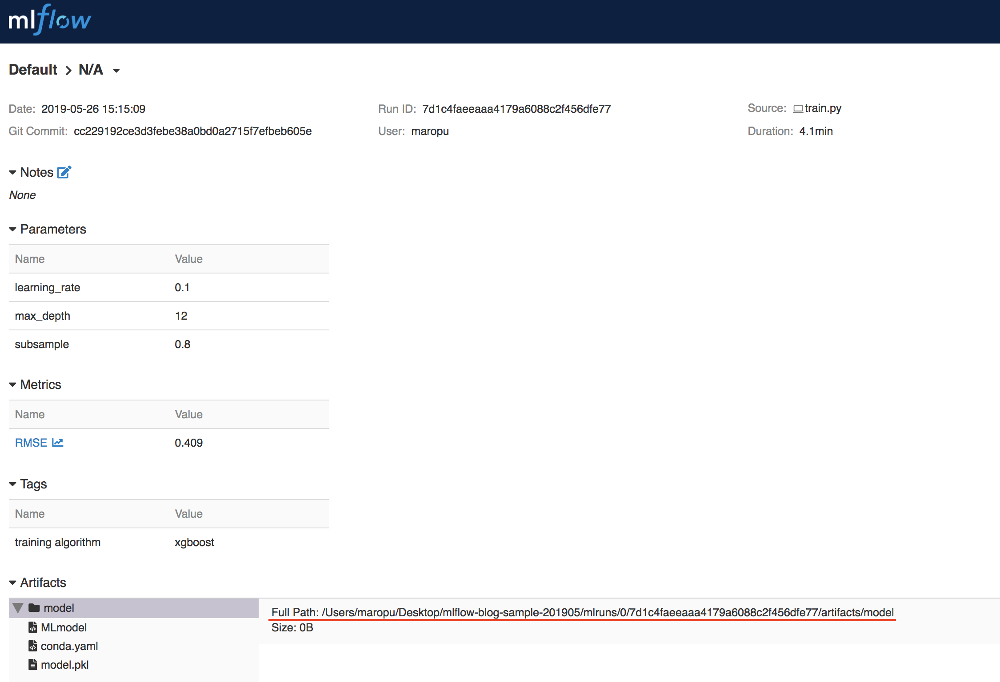

## What's MLflow?

[MLflow](https://www.mlflow.org/) provides some functionalities to improve ML model **trackability**,
**reproduciblity**, **reusability**, and also **deployability**.
For **trackability** and **reproduciblity**, it provides a logging framework and a simple Web UI to manage training logs
(e.g., datasets, features, and hyperparameters) about built ML models ([MLflow Tracking](https://www.mlflow.org/docs/latest/tracking.html)).
For **reusability**, it automatically resolves dependencies requird by [a training script](./train.py)
before learning models ([MLflow Projects](https://www.mlflow.org/docs/latest/projects.html)); it uses `conda` or `docker` to do so
(`conda` used in this example and all the dependencies listed in [conda.yaml](./conda.yaml)).
For **deployability**, it implements a simple command to deploy saved models in the MLflow logging framework
into ML inferrence engines, e.g., stand-alone REST servers and the Amazon SageMaker
([MLflow Models](https://www.mlflow.org/docs/latest/models.html)).

To install MLflow, type a command below:

    $ conda install -c conda-forge mlflow

## Walmart dataset

In this example, we use the Walmart dataset used in [the research project of the ADA Lab @ UCSD](https://adalabucsd.github.io/hamlet.html).
The dataset consists of three tables with foreign-key constraints: `S_sales`, `R1_indicators`, and `R2_stores`.
A target variable `y` is `weekly_sales` in `S_sales` and |`y`|=5 (`y`={2, 3, 4, 5, 6}).
So, you need to join the three tables before building a model and a join graph of the Walmart dataset is as follows:

```python
                                                       _ R2_stores{store, ...}
                                                      /
 S_sales{weekly_sales, sid, dept, ..., purchaseid, store}
         ^^^^^^^^^^^^                      /
                                          /
         R1_indicators{purchaseid, ...} _/
```

For more learning task details, see `5. EXPERIMENTS ON REAL DATA` in [the Hamlet paper](https://adalabucsd.github.io/papers/2016_Hamlet_SIGMOD.pdf).
The dataset is automatically downloaded when running a MLflow project:

    $ git clone https://github.com/maropu/mlflow-blog-sample-201905.git
    $ cd mlflow-blog-sample-201905
    $ mlflow run .
    Downloading 'RealWorldDatasets' and saving it in ./dataset
    ...
    XGBoost model (max_depth=3, learning_rate=0.1, subsample=1.0):
      RMSE: 0.933979

    $ cd dataset/RealWorldDatasets/Walmart
    $ ls
    R1_indicators.csv R2_stores.csv S_sales.csv

    $ head -n1 S_sales.csv
    "sid","weekly_sales","dept","store","purchaseid"

    $ head -n1 R1_indicators.csv
    purchaseid,temperature_avg,temperature_stdev,fuel_price_avg,fuel_price_stdev,cpi_avg,cpi_stdev,unemployment_avg,unemployment_stdev,holidayfreq

    $ head -n1 R2_stores.csv
    store,type,size

## Run a MLflow project for training

This is how to run [the training script](./train.py):

    $ mlflow run . -P max_depth=12,16,20 -P learning_rate=0.01,0.1 -P subsample=0.8,1.0

This run loads the dataset and then builds ML models by XGBoost.
The arguments (`max_depth`, `learning_rate`, and `subsample`) define `XGBoost` parameters for training
and the script builds 12 models (3 `max_depth`, 2 `learning_rate`, and 2 `subsample`) in the run.

MLflow first resolves all the dependencies requreid by the script and then invokes it.
It uses Spark to load the dataset and joins the three tables above
to make a single Spark DataFrame (`sdf`) for training:

```python
    sdf = spark.sql(
        "SELECT " \
            "CAST(TRIM(BOTH '\\'' FROM weekly_sales) AS INT) weekly_sales, " \
            "CAST(TRIM(BOTH '\\'' FROM sid) AS INT) sid, " \
            "CAST(TRIM(BOTH '\\'' FROM dept) AS INT) dept, " \
            "CAST(TRIM(BOTH '\\'' FROM s.store) AS INT) store, " \
            "CAST(TRIM(BOTH '\\'' FROM type) AS INT) type, " \
            "size, " \
            "temperature_stdev, " \
            "fuel_price_avg, " \
            "fuel_price_stdev, " \
            "cpi_avg, " \
            "cpi_stdev, " \
            "unemployment_avg, " \
            "unemployment_stdev, " \
            "holidayfreq " \
        "FROM " \
            "S_sales s, " \
            "R1_indicators i, " \
            "R2_stores st " \
        "WHERE " \
            "s.purchaseid = i.purchaseid AND " \
            "s.store = st.store")
```

It converts to a Pandas DataFrame and splits the DataFrame into two parts: training and test data.
Then, it tries to build 12 models with different parameters in individual MLflow execution contexts;
each context builds a XGBoost model and stores training logs and the built model in the MLflow logging framework:

```python
    # Converts into a Pandas DataFrame
    df = sdf.toPandas()

    # Splits `df` into two parts: training (`X_train` and `y_train`) and
    # test data (`X_test` and `y_test`)
    ...

    # Creates an execution context for a single run with given parameters (`md`, `lr`, and `ssr`)
    with mlflow.start_run(run_name=args.run_name) as run:
       clf = xgb.XGBClassifier(max_depth=int(md), learning_rate=float(lr), nthread=-1, subsample=float(ssr))
       clf.fit(X_train, y_train)

       # Computes a metric for the built model
       pred = clf.predict(X_test)
       rmse = np.sqrt(mean_squared_error(y_test, pred))

       # For better tracking, stores the training logs (the three parameters and the metric)
       # and the built model in the MLflow logging framework
       mlflow.set_tag('training algorithm', 'xgboost')
       mlflow.log_param('max_depth', md)
       mlflow.log_param('learning_rate', lr)
       mlflow.log_param('subsample', ssr)
       mlflow.log_metric('RMSE', rmse)
       mlflow.sklearn.log_model(clf, 'model')
```

To check the training logs and the built models above, you can launches a tracking server:

    $ mlflow ui
    [2019-05-24 14:08:44 +0900] [10955] [INFO] Starting gunicorn 19.9.0
    [2019-05-24 14:08:44 +0900] [10955] [INFO] Listening at: http://127.0.0.1:5000 (10955)
    [2019-05-24 14:08:44 +0900] [10955] [INFO] Using worker: sync
    [2019-05-24 14:08:44 +0900] [10958] [INFO] Booting worker with pid: 10958

When accessing `http://127.0.0.1:5000` in your browser, you can see a MLflow web UI below:


As you see, the run with `max_depth`=12, `learning_rate`=0.1, and `subsample`=0.8 is the best in the top.
In a detaild page for the run, you can find the corresponding model located in
`/Users/maropu/Desktop/mlflow-blog-sample-201905/mlruns/0/7d1c4faeeaaa4179a6088c2f456dfe77/artifacts/model` below.



By using a `mlflow pyfunc serve` command, you can launch a stand-alone REST server and deploy the model in it.
Besides this, you can also deploy into other ML inference services
(for example, the MLflow sagemaker tool for deploying models to Amazon SageMaker).
For more details, please see [the MLflow Models document](https://mlflow.org/docs/latest/models.html#mlflow-models).

    $ mlflow pyfunc serve -p 4321 -m /Users/maropu/Desktop/mlflow-blog-sample-201905/mlruns/0/7d1c4faeeaaa4179a6088c2f456dfe77/artifacts/model
     * Running on http://127.0.0.1:4321/ (Press CTRL+C to quit)

    $ curl -X POST -H "Content-Type:application/json; format=pandas-split" --data '{"columns":["sid", "dept", "store", "type", "size", "temperature_stdev", "fuel_price_avg", "fuel_price_stdev", "cpi_avg", "cpi_stdev", "unemployment_avg", "unemployment_stdev", "holidayfreq"],"data":[[159739, 1, 42, 3, 39690, 68.403, 6.617, 3.829, 0.598, 128.742, 2.454, 8.466, 1.071]]}' http://127.0.0.1:4321/invocations
    [4]

